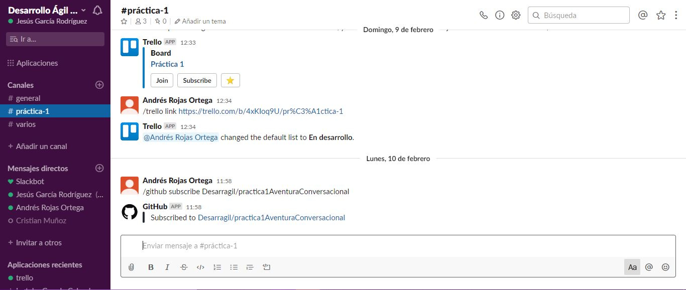
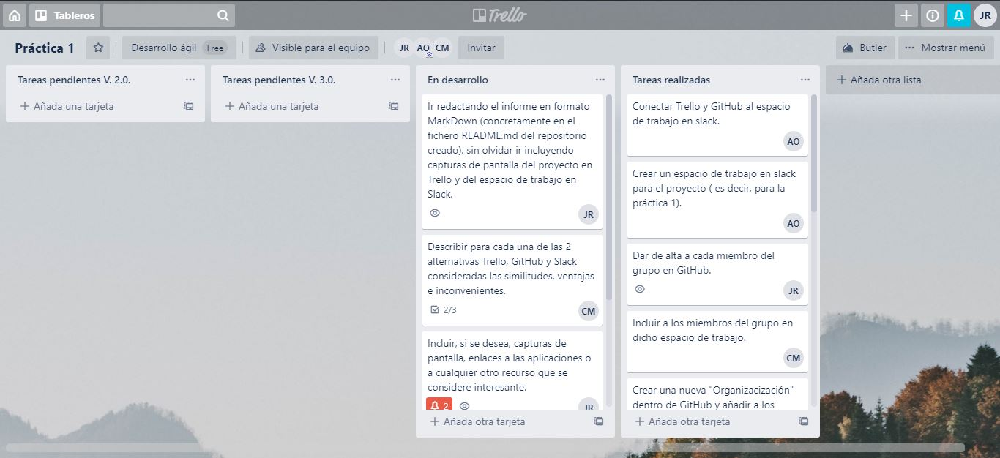
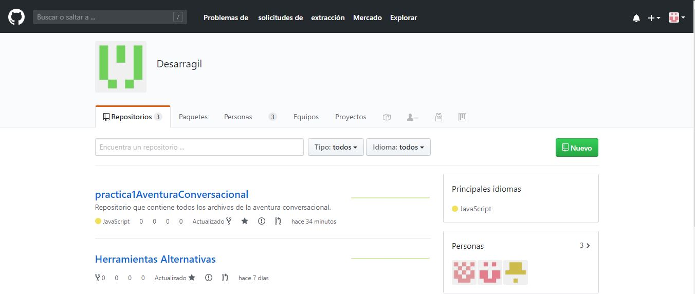

# HerramientasAlternativas

##INFORME DE REALIZACIÓN DE LA PRÁCTICA
Para la realización de esta práctica, hemos utilizado principalmente 3 herramientas: **Trello** (para la organización de las distintas tareas), **Slack** (para propiciar la comunicación entre los miembros del grupo de trabajo) y **GitHub** (para la utilización de repositorios remotos).

Hemos dividido el proyecto en 3 versiones, las cuales se componen de diferentes tareas que han sido asignadas a cada uno de nosotros:

- Versión 1.0, donde las tareas a realizar son:
	- Dar de alta a cada miembro en GitHub
	- Crear una nueva "organización" dentro de GitHub y añadir a los miembros del grupo
	- Crear un espacio de trabajo en Slack para el proyecto
	- Incluir a los miebros del grupo en dicho espacio de trabajo
	- Conectar Trello y GitHub al espacio de trabajo en Slack
- Versión 2.0, con las tareas:
	- Crear el primer repositorio en GitHub que albergará el informe sobre las herramientas alternativas
	- Redactar el informe en formato MarkDown en el fichero **README.md** del repositorio e incluir capturas de pantalla del proyecto en Trello y Slack
	- Describir para cada una de las 2 alternativas Trello, GitHub y Slack consideradas las similitudes, ventajas e inconvenientes
	- Incluir opcionalmente capturas de pantalla, enlaces a las aplicaciones o a cualquier otro recurso
	- Crear las tarjetas en Trello y asignar miembros y fechas límite de realización
- Versión 3.0, con las tareas:
	- Hacer un fork del proyecto original como nuevo repositorio de nuestra organización en GitHub
	- Desarrollar sobre papel una breve historia con entre 2 y 5 situaciones, cada una con entre 2 y 5 acciones, y máximo 3 objetos en la historia
	- Programar la historia diseñada usando Undum, el repositorio GitHub del grupo, las tarjetas en Trello, y Slack

En primer lugar, hemos creado un espacio de trabajo en Slack para poder comunicarnos los miembros del grupo y favorecer así la realización del trabajo:



Luego, hemos usado Trello para la organización y reparto de las tareas mediante la creación de tarjetas y asignación de las mismas:



Por último, hemos creado y manejado 2 repositorios Git, uno para las herramientas alternativas (este repositorio) y otro para la aventura conversacional:


